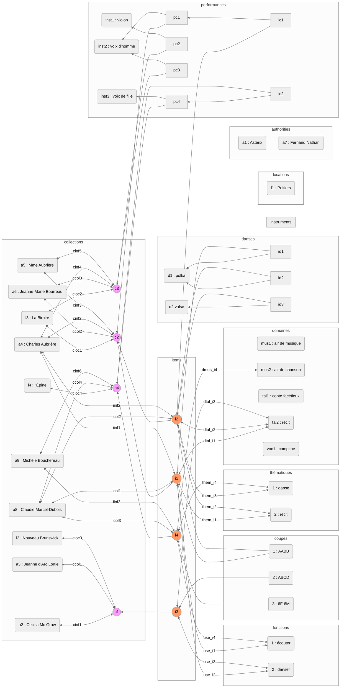

# Données de test
Les données de test sont dans le fichier `francoralité/apps/francoralite_api/fixtures/francoralite.json`

```mermaid
%%{init: {'theme':'neutral'}}%%
graph RL
    subgraph collections
    c1((c1))
    c1 <-- cinf1 --> a2
    c1 <-- ccol1 --> a3
    c1 <-- cloc3 --> l2
    c2((c2))
    c2 <-- cloc1 --> l3
    c2 <-- ccol2 --> a6
    c2 <-- cinf2 --> a4
    c2 <-- cinf3 --> a5
    c3((c3))
    c3 <-- cloc2 --> l3
    c3 <-- ccol3 --> a6
    c3 <-- cinf4 --> a4
    c3 <-- cinf5 --> a5
    c4((c4))
    c4 <-- cloc4 --> l4
    c4 <-- ccol4 --> a8
    c4 <-- cinf6 --> a9
    classDef collection fill:#f9f;
    class c1,c2,c3,c4 collection;
    end

    subgraph items
    i1([i1])
    i2([i2])
    i3([i3])
    i4([i4])
    classDef item fill:#f96;
    class i1,i2,i3,i4 item;
    i1 --> c2
    i1 <-- icol1 --> a8
    i1 <-- iinf1 --> a4
    i2 --> c2
    i2 <-- icol2 --> a8
    i2 <-- iinf2 --> a4
    i3 --> c1
    i4 --> c4
    i4 <-- icol3 --> a8
    i4 <-- iinf3 --> a9
    end

    subgraph danses
    d1(d1 : polka)
    d2(d2:valse)
    id1 --> d1
    id1 --> i1
    id2 --> d1
    id2 --> i2
    id3 --> d2
    id3 --> i2
    end

    subgraph performances
    pc1 --> c2
    pc1 --> inst2
    pc2 --> c3
    pc2 --> inst1
    pc3 --> c3
    pc3 --> inst2
    ic1 --> i2
    ic1 --> pc1
    pc4 --> c4
    pc4 --> inst3
    ic2 --> pc4
    ic2 --> c4
    end

    subgraph instruments
    inst1(inst1 : violon)
    inst2(inst2 : voix d'homme)
    inst3(inst3 : voix de fille)
    end

    subgraph locations
    l1(l1 : Poitiers)
    l2(l2 : Nouveau Brunswick)
    l3(l3 : La Biroire)
    l4(l4 : l'Épine)
    end

    subgraph authorities
    a1(a1 : Astérix)
    a2(a2 : Cecilia Mc Graw)
    a3(a3 : Jeanne d'Arc Lortie)
    a4(a4 : Charles Aubrière)
    a5(a5 : Mme Aubrière)
    a6(a6 : Jeanne-Marie Bourreau)
    a7(a7 : Fernand Nathan)
    a8(a8 : Claudie Marcel-Dubois)
    a9(a9 : Michèle Bouchereau)
    end

    subgraph coupes
    coup1(1 : AABB)
    coup2(2 : ABCD)
    coup3(3 : 6F-6M)
    coup1 --> i1
    coup1 --> i2
    coup2 --> i3
    coup3 --> i4
    end

    subgraph fonctions
    use1(1 : écouter)
    use2(2 : danser)
    use1 <-- use_i1 -->  i1
    use2 <-- use_i2 -->  i1
    use2 <-- use_i3 -->  i3
    use1 <-- use_i4 -->  i4
    end

    subgraph thématiques
    them1(1 : danse)
    them2(2 : récit)
    them2 <-- them_i1 --> i1
    them2 <-- them_i2 --> i2
    them1 <-- them_i3 --> i2
    them1 <-- them_i4 --> i4
    end

    subgraph domaines
    d_mus1(mus1 : air de musique)
    d_mus2(mus2 : air de chanson)
    d_mus2 <-- dmus_i4 --> i4
    d_tal1(tal1 : conte facétieux)
    d_tal2(tal2 : récit)
    d_tal2<-- dtal_i1 --> i1
    d_tal2<-- dtal_i2 --> i2
    d_tal2<-- dtal_i3 --> i3
    d_voc1(voc1 : comptine)
    end
```
